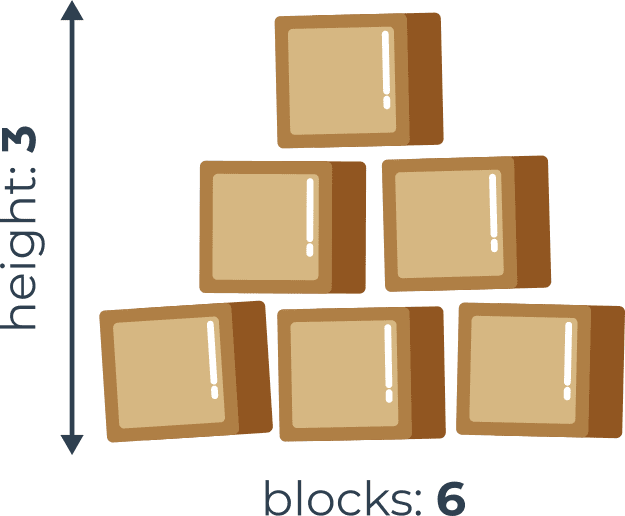

---

3.2.14   **LAB**   Essentials of the _while_ loop

---

## Scenario

Listen to this story: a boy and his father, a computer programmer, are playing with wooden blocks. They are building a pyramid.

Their pyramid is a bit weird, as it is actually a pyramid-shaped wall – it's flat. The pyramid is stacked according to one simple principle: each lower layer contains one block more than the layer above.

The figure illustrates the rule used by the builders:



Your task is to write a program which reads the number of blocks the builders have, and outputs the height of the pyramid that can be built using these blocks.

Note: the height is measured by the number of **fully completed layers** – if the builders don't have a sufficient number of blocks and cannot complete the next layer, they finish their work immediately.

Test your code using the data we've provided.

  

## Test Data:

**Sample input:**

```
6
```

Expected output:

```Output
The height of the pyramid: 3
```

**Sample input:**

```
20
```

Expected output:

```Output
The height of the pyramid: 5
```

**Sample input:**

```
1000
```

Expected output:

```Output
The height of the pyramid: 44
```

**Sample input:**

```
2
```

Expected output:

```Output
The height of the pyramid: 1
```

## Code:
```python
blocks = int(input("Enter the number of blocks: "))

#
# Write your code here.
#	

print("The height of the pyramid:", height)

```